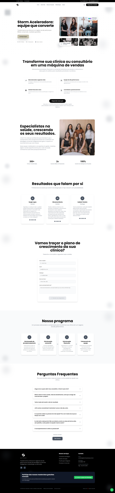
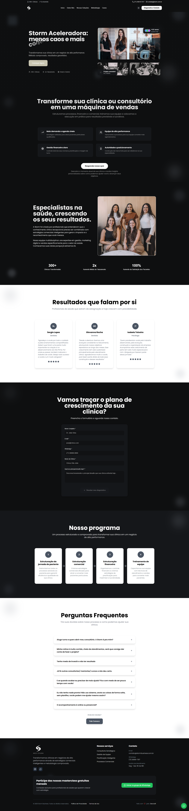

# ⚡ Storm Aceleradora — Site Institucional

Este repositório contém o código-fonte de um **Site institucional responsivo** desenvolvido para um cliente real, uma empresa especializada em consultoria de gestão e performance para clínicas e consultórios na área da saúde.

🔗 **Acesse o site oficial:** [https://stormbusiness.com.br/](https://stormbusiness.com.br/)

---

## 📸 Interface do Projeto

<div align="center">
  <p align="center">
    
    
  </p>
</div>

---

## 🎨 Design & Estética

- **Aesthetics Rich & Modern**: Tema escuro (Dark Mode) de alto contraste e design moderno baseado em *glassmorphism*, formas abstratas sutis e tipografia sofisticada.
- **Micro-Animações**: Transições de rota suaves, elementos interativos dinâmicos com Framer Motion e efeitos de fundo reativos ao movimento do mouse em Canvas (Grid de Pontos Interativos).
- **Responsividade Total**: Layout totalmente adaptado para telas mobile, tablets e desktops (Mobile-First / Tailwind).

---

## 🚀 Tecnologias Utilizadas

- **Core**: [React](https://react.dev/) + [TypeScript](https://www.typescriptlang.org/)
- **Build Tool**: [Vite](https://vitejs.dev/) (Rápido e otimizado)
- **Estilização**: [Tailwind CSS](https://tailwindcss.com/)
- **UI Components**: [shadcn/ui](https://ui.shadcn.com/) (baseado em Radix UI e Lucide Icons)
- **Animações**: [Framer Motion](https://www.framer.com/motion/)
- **Roteamento**: [React Router DOM](https://reactrouter.com/) (configurado com HashRouter para compatibilidade perfeita com servidores de hospedagem estática, como Hostinger/Apache)
- **Backend de Envio**: PHP (script leve para tratamento de formulários em servidores compartilhados)

---

## 🛠️ Funcionalidades Principais

- **Navegação de Roteamento SPA**: Seções dinâmicas e fluidas (Início, Sobre Nós, Nossas Soluções, Metodologia, Cases, Política de Privacidade e Termos de Uso).
- **Formulário com Validação em Tempo Real**: Máscara para WhatsApp/Telefone brasileiro, tratamento de erros visual e envio assíncrono via fetch AJAX.
- **Carregamento Condicional de CMS**: Suporte desacoplado para integração com WordPress (REST API / GraphQL) para edição dinâmica de conteúdo.
- **Design de FAQ Controlado**: Seção de perguntas frequentes estruturada em acordeão intuitivo.
- **Otimização SEO Completa**: Tags Open Graph (Facebook), Twitter Cards, e dados estruturados Schema.org JSON-LD para excelente ranqueamento orgânico.

---

## 🔒 Aviso de Segurança e Desacoplamento (Portfólio)

> [!NOTE]  
> Este projeto foi preparado e higienizado para publicação no GitHub como portfólio profissional. 
> 
> **Medidas de segurança aplicadas:**
> 1. Todas as credenciais, números de telefone reais, emails de contato e chaves privadas do cliente foram **removidos do código-fonte** e parametrizados usando **Variáveis de Ambiente (`.env`)**.
> 2. Arquivos compactados (`.zip`), bancos de dados e backups privados foram removidos do repositório.
> 3. As integrações com o WordPress CMS foram configuradas com fallbacks locais amigáveis, mantendo a aplicação 100% funcional mesmo sem o painel administrativo privado conectado.

---

## 💻 Como Rodar Localmente

### 1. Pré-requisitos
Certifique-se de ter o [Node.js](https://nodejs.org/) instalado em sua máquina.

### 2. Clonar o Repositório
```bash
git clone https://github.com/seu-usuario/site-storm.git
cd site-storm
```

### 3. Configurar Variáveis de Ambiente
Copie o arquivo `.env.example` para `.env` e preencha as chaves:
```bash
cp .env.example .env
```
_No Windows PowerShell:_
```powershell
Copy-Item .env.example .env
```

### 4. Instalar Dependências e Iniciar Servidor
```bash
# Instala as dependências do npm
npm install

# Inicia o servidor de desenvolvimento local
npm run dev
```
O projeto estará rodando localmente em `http://localhost:5173/` (ou na porta indicada no terminal).

### 5. Compilar para Produção (Build)
```bash
npm run build
```
O comando acima gerará a pasta `dist` otimizada com todos os arquivos estáticos e executará o script pós-build para copiar os arquivos essenciais (`.htaccess` e `enviar-formulario.php`).

---

## 📄 Licença

Este projeto está sob a licença MIT. Sinta-se à vontade para utilizá-lo como base de portfólio ou referência de desenvolvimento!

---
*Desenvolvido com foco em alta performance e qualidade estética por **DevCraft**.*
